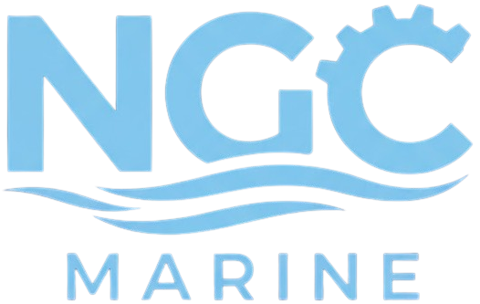

# NGC GLOBAL WEBSITE CONTENT UPDATE GUIDE

**Project:** NGC Marine → NGC Global Rebrand  
**Purpose:** Broaden focus from marine-only to marine + industrial gearboxes  
**Constraint:** TEXT CHANGES ONLY - No layout/design modifications  
**Date:** 2024

---

## 🎯 OVERVIEW OF CHANGES

### What's Changing:
- **Company Name:** "NGC Marine" → "NGC Global"
- **Tagline:** Remove "Geared for a Better Future"
- **Content Balance:** 60% Marine + 40% Industrial (instead of 100% Marine)
- **Product Categories:** Add industrial gearbox types alongside marine
- **Images:** 7 images need replacement (same filenames)

### What's NOT Changing:
- ✅ Website layout/structure
- ✅ CSS/styling
- ✅ Navigation structure
- ✅ Section order
- ✅ Design elements

---

## 📝 SECTION-BY-SECTION TEXT UPDATES

### HTML `<head>` Section

**Current:**
```html
<title>NGC Marine | Homepage</title>
<meta name="keywords" content="marine transmission, dredger gearbox, marine propulsion, CPP systems, azimuth thruster">
<meta name="description" content="Leading manufacturer of marine transmission equipment and specialized dredging gearboxes. Geared for a better future.">
<meta property="og:title" content="NGC Marine | Homepage">
<meta property="og:description" content="Leading manufacturer of marine transmission equipment and specialized dredging gearboxes. Geared for a better future.">
```

**Replace With:**
```html
<title>NGC Global | Industrial & Marine Gearbox Solutions</title>
<meta name="keywords" content="industrial gearbox, marine transmission, cement mill gearbox, dredger gearbox, mining gearbox, marine propulsion, power generation gearbox">
<meta name="description" content="Leading manufacturer of industrial and marine transmission equipment. Specialized gearboxes for cement, mining, power generation, dredging, and marine propulsion.">
<meta property="og:title" content="NGC Global | Industrial & Marine Gearbox Solutions">
<meta property="og:description" content="Leading manufacturer of industrial and marine transmission equipment. Specialized gearboxes for cement, mining, power generation, dredging, and marine propulsion.">
```

---

### HEADER - Logo Alt Text

**Current:**
```html

```

**Replace With:**
```html

```

📸 **IMAGE UPDATE REQUIRED:**
- **File:** `assets/logo.png`
- **Action:** Replace with NGC Global logo (either original NGC logo or new design)
- **Keep filename:** `logo.png`

---

### NAVIGATION - Industry Flyout

**Current:**
```html
<div class="fl-header__flyout--content">
    <h3>Industries We Serve</h3>
    <p>NGC Marine provides specialized transmission solutions for maritime and dredging industries worldwide.</p>
</div>
```

**Replace With:**
```html
<div class="fl-header__flyout--content">
    <h3>Industries We Serve</h3>
    <p>NGC Global provides specialized transmission solutions for marine, cement, mining, power generation, oil & gas, and manufacturing industries worldwide.</p>
</div>
```

---

### NAVIGATION - Applications Flyout

**Current:**
```html
<div class="fl-header__flyout--content">
    <h3>Applications</h3>
    <p>From dredging to marine propulsion, our solutions power critical maritime operations.</p>
</div>
```

**Replace With:**
```html
<div class="fl-header__flyout--content">
    <h3>Applications</h3>
    <p>From cement mills and mining crushers to dredging and marine propulsion, our gearbox solutions power critical industrial and maritime operations.</p>
</div>
```

---

### NAVIGATION - Products Mega Menu Description

**Current:**
```html
<p>Comprehensive range of marine transmission systems and dredger gearboxes engineered for reliability and performance.</p>
```

**Replace With:**
```html
<p>Comprehensive range of industrial and marine transmission systems engineered for reliability and performance in demanding applications.</p>
```

---

### PRODUCTS MEGA MENU - ADD NEW COLUMN 1: INDUSTRIAL GEARBOXES

**IMPORTANT:** This replaces the "Dredger Gearboxes" column. Dredger content moves to a Marine-specific subsection.

**Replace Entire Column 1 With:**
```html
<!-- COLUMN 1: INDUSTRIAL GEARBOXES (NEW) -->
<div class="col-md-3 sub-navigation-section">
    <div class="caption">
        <h2>Industrial Gearboxes</h2>
    </div>
    <ul class="fl-flyout-navigation--item-list">
        <li class="fl-flyout-navigation--item-link">
            <a href="#" title="Cement Mill Gearbox">
                <div class="fl-flyout-navigation-icon">
                    
                </div>
                <div class="fl-flyout-navigation-title">Cement Mill Gearbox</div>
            </a>
        </li>
        <li class="fl-flyout-navigation--item-link">
            <a href="#" title="Mining Crusher Gearbox">
                <div class="fl-flyout-navigation-icon">
                    
                </div>
                <div class="fl-flyout-navigation-title">Mining Crusher Gearbox</div>
            </a>
        </li>
        <li class="fl-flyout-navigation--item-link">
            <a href="#" title="Conveyor Drive Gearbox">
                <div class="fl-flyout-navigation-icon">
                    
                </div>
                <div class="fl-flyout-navigation-title">Conveyor Drive Gearbox</div>
            </a>
        </li>
        <li class="fl-flyout-navigation--item-link">
            <a href="#" title="Mill Drive Gearbox">
                <div class="fl-flyout-navigation-icon">
                    
                </div>
                <div class="fl-flyout-navigation-title">Mill Drive Gearbox</div>
            </a>
        </li>
        <li class="fl-flyout-navigation--item-link">
            <a href="#" title="Extruder Gearbox">
                <div class="fl-flyout-navigation-icon">
                    
                </div>
                <div class="fl-flyout-navigation-title">Extruder Gearbox</div>
            </a>
        </li>
        <li class="fl-flyout-navigation--item-link">
            <a href="#" title="Power Generation Gearbox">
                <div class="fl-flyout-navigation-icon">
                    
                </div>
                <div class="fl-flyout-navigation-title">Power Generation Gearbox</div>
            </a>
        </li>
        <li class="fl-flyout-navigation--item-link">
            <a href="#" title="Custom Industrial Gearbox">
                <div class="fl-flyout-navigation-icon">
                    
                </div>
                <div class="fl-flyout-navigation-title">Custom Industrial Gearbox</div>
            </a>
        </li>
        <li class="fl-flyout-navigation--item-link fl-flyout-navigation--all-link">
            <a href="#" title="All Industrial Gearboxes">
                <div class="fl-flyout-navigation-title"><strong>ALL INDUSTRIAL GEARBOXES</strong></div>
            </a>
        </li>
    </ul>
</div>
```

📸 **ICON IMAGES NEEDED** (Create folder: `assets/icons/industrial/`):
- `cement-mill.svg`
- `crusher.svg`
- `conveyor.svg`
- `mill-drive.svg`
- `extruder.svg`
- `power-gen.svg`
- `custom.svg`

---

### PRODUCTS MEGA MENU - RENAME COLUMN 2

**Current Column Title:**
```html
<h2>Marine Propulsion</h2>
```

**Replace With:**
```html
<h2>Marine & Dredger Systems</h2>
```

Keep all existing items under this column (CPP Systems, FPP Gearbox, Azimuth Thruster, etc.)

---

## 🎬 HERO SECTION

**Current:**
```html
<h1 class="hero-title">Driving Marine Innovation Forward</h1>
<p class="hero-subtitle">Leading manufacturer of marine transmission equipment and specialized dredging gearboxes</p>
```

**Replace With:**
```html
<h1 class="hero-title">Precision Gearbox Solutions for Industry & Marine</h1>
<p class="hero-subtitle">Leading manufacturer of industrial and marine transmission equipment for cement, mining, power generation, dredging, and propulsion applications</p>
```

---

### HERO STATS BOXES

**Current:**
```html
<div class="hero-stat-box">
    <div class="hero-stat-number">#1</div>
    <div class="hero-stat-label">China Dredger Market</div>
</div>
```

**Replace With:**
```html
<div class="hero-stat-box">
    <div class="hero-stat-number">10+</div>
    <div class="hero-stat-label">Industries Served</div>
</div>
```

---

## 🔄 MAIN CONTENT SECTIONS - TEXT UPDATES

### SECTION 1: Change from "Dredger Gearboxes" to "Industrial Gearboxes"

**Current:**
```html
<h2 style="color: #00224B;">Dredger Gearboxes</h2>
<h3 style="color: #00224B;">POWERING THE WORLD'S LARGEST DREDGERS</h3>
<p style="color: #333; line-height: 1.8;">Comprehensive transmission solutions for cutter suction dredgers, drag suction dredgers, and bucket wheel dredgers. From submerged cutter gearboxes to pump drive systems, NGC Marine delivers complete power integration for vessels ranging from 2,700m³ to 38,000m³.</p>
<a href="#" title="Discover Now">Discover Now</a>
```

**Replace With:**
```html
<h2 style="color: #00224B;">Industrial Gearboxes</h2>
<h3 style="color: #00224B;">DRIVING GLOBAL MANUFACTURING & PROCESSING</h3>
<p style="color: #333; line-height: 1.8;">Comprehensive transmission solutions for cement mills, mining crushers, conveyors, and processing equipment. NGC Global delivers high-torque, reliable gearboxes engineered for 24/7 operation in the harshest industrial environments including cement plants, mines, and manufacturing facilities worldwide.</p>
<a href="#" title="Discover Industrial Solutions">Discover Industrial Solutions</a>
```

📸 **IMAGE UPDATE REQUIRED:**
- **File:** `assets/images/section-1-dredger-gearboxes.jpg`
- **Replace with:** Industrial gearbox image (cement mill, crusher, or factory setting)
- **Keep filename:** `section-1-dredger-gearboxes.jpg` (don't rename)

---

### SECTION 2: Keep Marine Project, Update Text Slightly

**Current:**
```html
<h2 style="color: #00224B;">Landmark Project</h2>
<h3 style="color: #00224B;">38,168 M³ TSHD - LARGEST IN ASIA</h3>
<p style="color: #333; line-height: 1.8;">NGC Marine supplied the complete main propulsion gearbox system for the Tongjun TSHD, the largest trailing suction hopper dredger in Asia and third globally. This 195-meter vessel represents the pinnacle of dredging technology and NGC's engineering excellence.</p>
```

**Replace With:**
```html
<h2 style="color: #00224B;">Marine Excellence</h2>
<h3 style="color: #00224B;">38,168 M³ TSHD - LARGEST IN ASIA</h3>
<p style="color: #333; line-height: 1.8;">NGC Global supplied the complete main propulsion gearbox system for the Tongjun TSHD, the largest trailing suction hopper dredger in Asia and third globally. This 195-meter vessel showcases our marine division's engineering excellence and capability to deliver mission-critical transmission solutions.</p>
```

✅ **IMAGE:** Keep existing `section-2-tongjun-tshd.jpg` (no change needed)

---

### SECTION 3: Rename from "Marine Propulsion" to "Marine & Dredging Systems"

**Current:**
```html
<h2 style="color: #00224B;">Marine Propulsion</h2>
<h3 style="color: #00224B;">COMPLETE PROPULSION SOLUTIONS</h3>
<p style="color: #333; line-height: 1.8;">From CPP systems to azimuth thrusters, NGC Marine provides integrated propulsion solutions for modern vessels. Our NCP, CK, and CG series gearboxes deliver reliable performance for fixed and controllable pitch propeller systems.</p>
```

**Replace With:**
```html
<h2 style="color: #00224B;">Marine & Dredging Systems</h2>
<h3 style="color: #00224B;">COMPLETE MARINE TRANSMISSION SOLUTIONS</h3>
<p style="color: #333; line-height: 1.8;">From dredger gearboxes to vessel propulsion systems, NGC Global provides integrated marine transmission solutions. Our product range includes submerged cutter gearboxes, CPP/FPP systems, azimuth thrusters, and complete power packages for dredging and marine vessels.</p>
```

📸 **IMAGE UPDATE OPTIONAL:**
- **File:** `assets/images/section-3-marine-propulsion.jpg`
- **Consider:** Image showing both dredging equipment AND ship propulsion
- **Keep filename:** `section-3-marine-propulsion.jpg`

---

### SECTION 5: Manufacturing Banner - Update Text

**Current:**
```html
<h2 style="color: #fff;">PROVINCIAL INDUSTRY DESIGN CENTER</h2>
<p style="color: #fff;">Awarded by Jiangsu Economic and Information Committee, NGC Marine's design center represents the highest level of technical capability in marine transmission equipment. Complete in-house design and manufacturing ensures quality and precision.</p>
<a href="#" class="btn">Our Facilities</a>
```

**Replace With:**
```html
<h2 style="color: #fff;">PROVINCIAL INDUSTRY DESIGN CENTER</h2>
<p style="color: #fff;">Awarded by Jiangsu Economic and Information Committee, NGC Global's design center represents the highest level of technical capability in industrial and marine transmission equipment. Complete in-house design and manufacturing ensures quality and precision across all applications.</p>
<a href="#" class="btn">Our Capabilities</a>
```

📸 **IMAGE UPDATE RECOMMENDED:**
- **File:** `assets/images/section-5-manufacturing-banner.jpg`
- **Replace with:** Modern manufacturing facility image (CNC machines, gearbox assembly)
- **Keep filename:** `section-5-manufacturing-banner.jpg`

---

### SECTION 6: Integrated Systems - Keep Similar Focus

**Current:**
```html
<h2 style="color: #00224B;">Integrated Solutions</h2>
<h3 style="color: #00224B;">COMPLETE POWER SYSTEM INTEGRATION</h3>
<p style="color: #333; line-height: 1.8;">Beyond individual components, NGC Marine delivers fully integrated power systems. From hybrid power configurations to complete dredging equipment packages, we provide turnkey solutions optimized for performance and reliability.</p>
```

**Replace With:**
```html
<h2 style="color: #00224B;">Integrated Solutions</h2>
<h3 style="color: #00224B;">COMPLETE POWER SYSTEM INTEGRATION</h3>
<p style="color: #333; line-height: 1.8;">Beyond individual components, NGC Global delivers fully integrated power systems. From industrial drive train packages to complete marine propulsion systems, we provide turnkey solutions optimized for performance, reliability, and efficiency across all industries.</p>
```

✅ **IMAGE:** Keep existing `section-6-integrated-systems.jpg` (or update if too marine-specific)

---

### SECTION 7: Service Portfolio Title Update

**Current:**
```html
<h2>The NGC Marine Service Portfolio</h2>
```

**Replace With:**
```html
<h2>The NGC Global Service Portfolio</h2>
```

All service phase content can remain the same (Equipment Setup, Normal Operations, etc.) as it applies to both industrial and marine gearboxes.

---

### SECTION 8: Sustainability Banner - Minor Update

**Current:**
```html
<h3>MAKING A CONTRIBUTION TO THE FUTURE</h3>
<p>Sustainability forms the basis of our activity. To us, sustainable corporate success means taking responsibility for our environment, our employees and society, at a product level and along our own delivery chain.</p>
```

**Replace With:**
```html
<h3>ENGINEERING FOR A SUSTAINABLE FUTURE</h3>
<p>Sustainability drives innovation in our industrial and marine transmission solutions. We take responsibility for environmental impact, employee welfare, and societal contribution through efficient product design, responsible manufacturing, and lifecycle support.</p>
```

✅ **IMAGE:** Keep existing `sustainability-banner.jpg` (generic enough)

---

### SECTION 9: Company Banner - Update Text

**Current:**
```html
<h3>20 YEARS OF NGC MARINE: COMMITTED TO A VISION</h3>
<p>The world is changing, but one thing remains constant: the need for reliable marine transmission solutions. Our vision is working together closely with all our stakeholders, jointly shaping a sustainable future and achieving optimum value for our customers. We are the Partner of Choice for Marine Transmission Excellence.</p>
<a href="#" class="btn">About NGC Marine</a>
```

**Replace With:**
```html
<h3>20 YEARS OF NGC GLOBAL: COMMITTED TO EXCELLENCE</h3>
<p>The world is changing, but one thing remains constant: the need for reliable transmission solutions across industries. Our vision is working together closely with all stakeholders, jointly shaping a sustainable future and achieving optimum value for our customers in marine, industrial, and power generation markets. We are the Partner of Choice for Transmission Excellence.</p>
<a href="#" class="btn">About NGC Global</a>
```

📸 **IMAGE UPDATE RECOMMENDED:**
- **File:** `assets/images/company-banner.jpg`
- **Replace with:** Company image showing diverse team or facility (not just ships)
- **Keep filename:** `company-banner.jpg`

---

## 🦶 FOOTER UPDATES

### Footer Column 1

**Current:**
```html
<h4 style="color: #fff;">NGC Marine</h4>
<p style="color: #999;">Leading manufacturer of marine transmission equipment and specialized dredging gearboxes.</p>
```

**Replace With:**
```html
<h4 style="color: #fff;">NGC Global</h4>
<p style="color: #999;">Leading manufacturer of industrial and marine transmission equipment serving cement, mining, power generation, dredging, and propulsion industries worldwide.</p>
```

---

### Footer Column 2 - Update Product Links

**Current:**
```html
<h4 style="color: #fff;">Products</h4>
<ul style="list-style: none; padding: 0;">
    <li><a href="#" style="color: #999;">Dredger Gearboxes</a></li>
    <li><a href="#" style="color: #999;">Marine Propulsion</a></li>
    <li><a href="#" style="color: #999;">Integrated Solutions</a></li>
    <li><a href="#" style="color: #999;">Components & Services</a></li>
</ul>
```

**Replace With:**
```html
<h4 style="color: #fff;">Products</h4>
<ul style="list-style: none; padding: 0;">
    <li><a href="#" style="color: #999;">Industrial Gearboxes</a></li>
    <li><a href="#" style="color: #999;">Marine & Dredging Systems</a></li>
    <li><a href="#" style="color: #999;">Integrated Solutions</a></li>
    <li><a href="#" style="color: #999;">Service & Support</a></li>
</ul>
```

---

### Footer Column 4 - Update Contact

**Current:**
```html
<p style="color: #999;">
    NGC Marine Corporation<br>
    Shanghai, China<br>
    Email: info@ngcmarine.com<br>
    Phone: +86 XXX XXXX XXXX
</p>
```

**Replace With:**
```html
<p style="color: #999;">
    NGC Global Corporation<br>
    Nanjing, Jiangsu, China<br>
    Email: info@ngcglobal.com<br>
    Phone: +86 XXX XXXX XXXX
</p>
```

---

### Footer Copyright

**Current:**
```html
<p style="color: #666;">&copy; 2024 NGC Marine Corporation. All rights reserved.</p>
```

**Replace With:**
```html
<p style="color: #666;">&copy; 2024 NGC Global Corporation. All rights reserved.</p>
```

---

## 📸 IMAGE REPLACEMENT SUMMARY

**Total Images to Replace:** 7 files

### REQUIRED (Must Replace):

1. **`assets/logo.png`**
   - Replace with: NGC Global logo
   - Notes: Most critical change

2. **`assets/images/section-1-dredger-gearboxes.jpg`**
   - Replace with: Industrial gearbox/cement mill/factory image
   - Notes: Section now focuses on industrial

### RECOMMENDED (Should Replace):

3. **`assets/images/section-5-manufacturing-banner.jpg`**
   - Replace with: Modern CNC/manufacturing facility
   - Notes: Make it feel industrial + marine capable

4. **`assets/images/company-banner.jpg`**
   - Replace with: Company/team photo or diverse facility
   - Notes: Less marine-specific

### OPTIONAL (May Replace):

5. **`assets/images/section-3-marine-propulsion.jpg`**
   - Consider: Image showing dredger + ship propulsion together
   - Notes: Only if current image is too narrow

6. **`assets/images/section-6-integrated-systems.jpg`**
   - Consider: More general integrated systems image
   - Notes: Only if too marine-specific

7. **`assets/hero-video.mp4`**
   - Consider: Video showing both industrial and marine applications
   - Notes: Only if current video is 100% ships/dredgers

### KEEP AS-IS:
- ✅ `section-2-tongjun-tshd.jpg` (Marine showcase is fine)
- ✅ `sustainability-banner.jpg` (Generic enough)
- ✅ `products-flyout.jpg` (If generic gearbox image)

---

## 🎨 NEW ICON FOLDER NEEDED

**Create folder:** `assets/icons/industrial/`

**Add 7 SVG icons:**
1. `cement-mill.svg` - Cement mill/grinding icon
2. `crusher.svg` - Crusher/mining icon
3. `conveyor.svg` - Conveyor belt icon
4. `mill-drive.svg` - Generic mill drive icon
5. `extruder.svg` - Extruder/plastics icon
6. `power-gen.svg` - Power generation turbine icon
7. `custom.svg` - Custom gearbox/settings icon

**Style:** Match existing icon style in `assets/icons/dredger/` and `assets/icons/propulsion/`

---

## ✅ IMPLEMENTATION CHECKLIST

### Phase 1: Critical Changes
- [ ] Update `<title>` and meta tags in `<head>`
- [ ] Replace logo: `assets/logo.png`
- [ ] Replace ALL instances of "NGC Marine" → "NGC Global" (Find & Replace)
- [ ] Update hero title and subtitle
- [ ] Update hero stats (change "#1 China Dredger Market" → "10+ Industries Served")

### Phase 2: Navigation Updates
- [ ] Update Industry flyout description
- [ ] Update Applications flyout description
- [ ] Replace Products mega menu Column 1 with Industrial Gearboxes
- [ ] Rename Column 2 to "Marine & Dredging Systems"
- [ ] Add industrial icons folder with 7 SVG files

### Phase 3: Content Sections
- [ ] Section 1: Change to Industrial Gearboxes + replace image
- [ ] Section 2: Minor text update (keep image)
- [ ] Section 3: Rename to Marine & Dredging Systems
- [ ] Section 5: Update manufacturing text
- [ ] Section 6: Update integrated solutions text
- [ ] Section 7: Update service portfolio title
- [ ] Section 8: Update sustainability text
- [ ] Section 9: Update company banner text

### Phase 4: Footer & Final
- [ ] Update footer company description
- [ ] Update footer product links
- [ ] Update footer contact info
- [ ] Update footer copyright
- [ ] Final review: Search for any remaining "NGC Marine" instances

---

## 🚨 IMPORTANT NOTES FOR IMPLEMENTATION

### What TO Change:
- ✅ All text content as specified above
- ✅ Meta descriptions
- ✅ ALT attributes

### What NOT TO Change:
- ❌ CSS classes or IDs
- ❌ HTML structure/layout
- ❌ JavaScript functionality
- ❌ Bootstrap grid system
- ❌ Any styling attributes
- ❌ Navigation structure (just text content)
- ❌ Image filenames (keep same names, just replace the files)

### Find & Replace Operations:
- `NGC Marine` → `NGC Global` (Global replace)
- `ngcmarine.com` → `ngcglobal.com` (Email addresses)
- Check for case variations: `NGC MARINE`, `ngc marine`, etc.

---

## 📋 CONTENT GUIDELINES

### Tone & Voice:
- Professional and technical
- Industry-focused (not just maritime)
- Emphasize reliability, precision, and versatility
- Balance marine heritage with industrial capability

### Key Messaging:
- **Versatility:** Industrial + Marine expertise
- **Experience:** 20 years serving multiple industries
- **Quality:** Provincial Design Center, complete in-house capabilities
- **Range:** From cement mills to largest dredgers
- **Integration:** Complete systems, not just components

---

## 🎯 CONTENT BALANCE TARGET

**Current Website:** 100% Marine

**Updated Website:**
- 40% Industrial gearboxes (cement, mining, manufacturing)
- 40% Marine & dredging systems
- 20% Integrated solutions & services (applies to both)

---

## 📂 NEXT STEPS

1. Save this document to: `D:\Skubbs\NGC\NGC-Global\NGC-Global-Website-Updates.md`
2. Provide to Claude Code in your IDE
3. Ask Claude Code to implement changes while preserving all layout/styling
4. Replace 7 image files with industrial-appropriate alternatives
5. Add industrial icon set (7 SVG files)
6. Review and test all changes

---

**Generated for NGC Global website rebrand project**  
*Maintains existing design while broadening market focus*